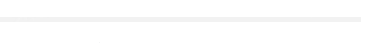
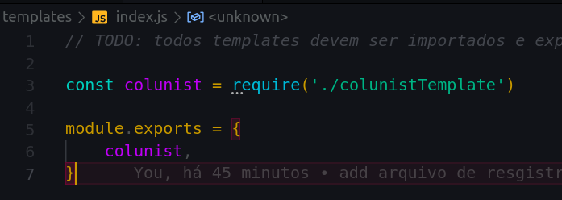
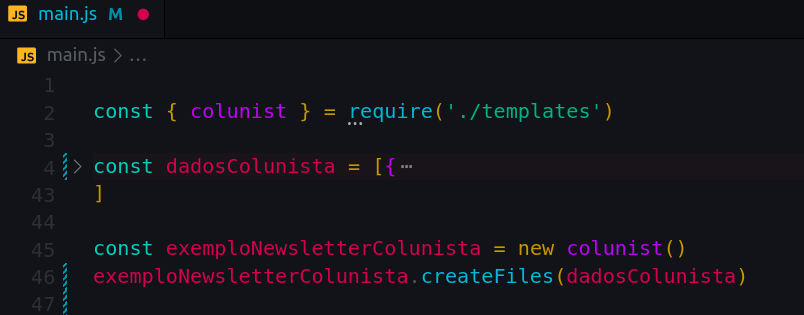

> Data da última alteração: 19/04/2022

> Alterado por Fernando josé <febarros@uolinc.com>

# Newsletter generate


* Gerador de arquivos de newsletter via SVN.

## Dependências

- node e npm

## Clonar o projeto:

```bash
git clone https://stash.uol.intranet/scm/~febarros/newsletter_generate.git
```


# Comandos npm


> Para os comando abaixo funcionar deve ser rodado no mesmo nivel do arquivo **package.json**


## Rodar projeto

Acesse a raiz do projeto via terminal e rode o comando:

```bash
npm run start
```





## Criar template

**1** Rode o comando abaixo na raiz do projeto 

```bash
npm run tplcreate
```

**2** Uma msg será exibida perguntando o nome do template digite de enter. Após isso um arquivo como o mesmo nome digitado será criado no caminho **./templates/nomeDigitado.js**

**3** Registre o template


## Registar template

**1** Abra o arquivo **./templates/index.js**

**2** Import o arquivo de template desejado da pasta **./template**

**3** Registre no objeto do module.exports




# Arquivos


#### main.js

Este arquivo é onde será setado os dados dinamicos  e o template no qual os dados serão injetados.

Ele tambem é o responsavel pro executar processo ao rodar **npm run start**



na linha 2 pode ser procurado os templates registrados em ./templates/index.js


## NewsletterFile.js

Possui metodos necessários para criação de arquivos compatíveis com  encode de newsletters via svn

O arquivo exporta a referencia da class **newsletterFile**


### Métodos staticos


**composeFileName**

retorna uma string composta pelos valor de name e extension

extension possui um valor default = xml

| Parametros | Obrigatório | Tipo   | Valor de default | Descrição |
| ---------- | ----------- | ------ | ---------------- | --------- |
| name       |             | string |                  |           |
| extension  |             | string | xml              |           |


**createFile**

Possibilita a criação de arquivos com encode, nome, extensão especifico. 

| Parametros  | Obrigatorio | Tipo   | Valor de default | Descrição                          |
| ----------- | ----------- | ------ | ---------------- | ---------------------------------- |
| output_path | sim         | string |                  | path onde arquivo será criado      |
| content     | sim         | string |                  | conteúdo a ser inserido no arquivo |
| name        | nao         | string | newsletter       | nome que arquivo será criado       |
| extension   | nao         | string | xml              | extensão que arquivo será salvo    |
| encode      | nao         | string | 'binary'         | tipo do encode a ser salvo         |


**createFolder**

Cria uma pasta no caminho setado em path, com o nome igual ao setado em slug.

| Parametros | Obrigatorio | Tipo   | Valor Default | Descrição                      |
| ---------- | ----------- | ------ | ------------- | ------------------------------ |
| path       | sim         | string |               | local onde será criada a pasta |
| slug       | sim         | string |               | nome da pasta                  |


## Arquivos de templates


Está é a estrutura base de um template criado via **npm run tplcreate**

```javascript
// [ICreateTemplate] garante que os metodos template createFile seja implementados
// [NewsletterFile] possui metodos para criaçao de arquivos com encode compativel em newsletter
const ICreateTemplate = require('../core/ITemplate')
const NewsletterFile = require('../core/NewsletterFile')


// TODO: OBS para utilizacao e melhor organizacao após criar seu template
// registre o mesmo no arquivo ./templates/index.js

class nomeTemplate extends ICreateTemplate {
    constructor() {
        super()
    }

    template() {
        // TODO: IMPLEMENTAR TEMPLATE
    }

    createFile(data) {
       // TODO: IMPLEMENTAR CREATE-FILE
    }
}

module.exports = nomeTemplate
```


